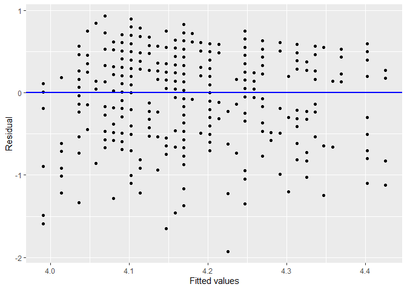
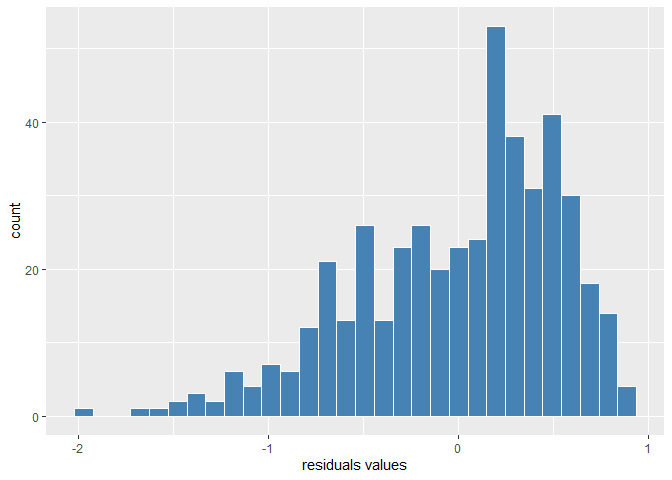
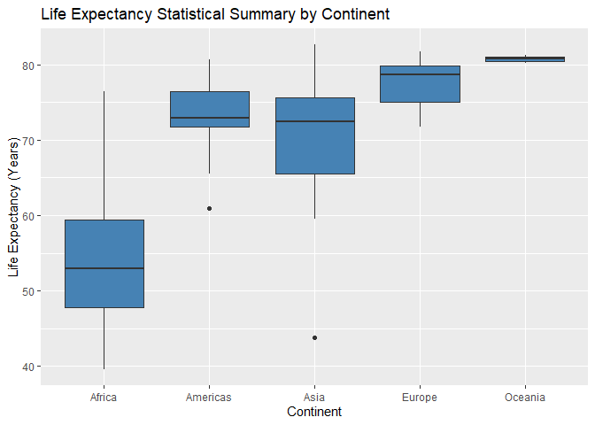
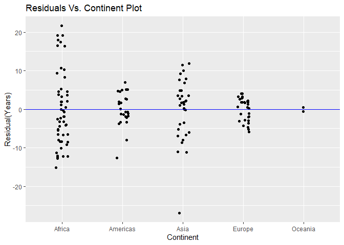
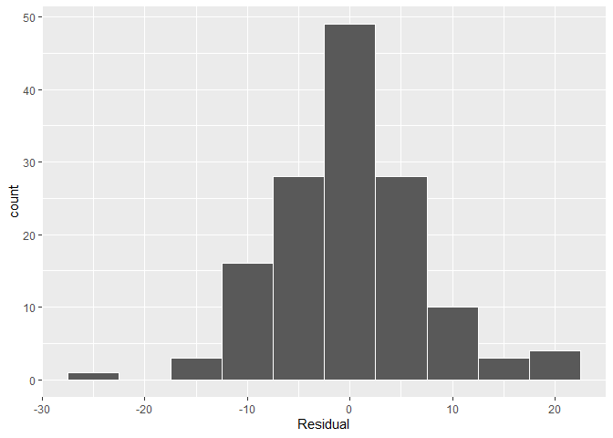

Lab1-Week4
================
Mohamed Jalaly
2/8/2022

    ## 
    ## Attaching package: 'dplyr'

    ## The following objects are masked from 'package:stats':
    ## 
    ##     filter, lag

    ## The following objects are masked from 'package:base':
    ## 
    ##     intersect, setdiff, setequal, union

    ## Warning: package 'moderndive' was built under R version 4.1.2

    ## Warning: package 'gapminder' was built under R version 4.1.2

    ## Warning: package 'skimr' was built under R version 4.1.2

# Simple Linear Regression

For response variable **y**, and explanatory variable **x**, the data
can be expressed as:

(*y*<sub>*i*</sub>, *x*<sub>*i*</sub>),   *i* = 1, 2, ..., *n*.

Hence, a simple linear regression model can be written as follows:

*y*<sub>*i*</sub> = *α* + *β**x*<sub>*i*</sub> + *ϵ*<sub>*i*</sub>,    *ϵ*<sub>*i*</sub> ∼ *N*(0, *σ*<sup>2</sup>),
where:

-   *y*<sub>*i*</sub> is the *i*<sup>*t**h*</sup> observation of the
    response variable;
-   *α* is the intercept of the regression line;
-   *β* is the slope of the regression line;
-   *x*<sub>*i*</sub> is the *i*<sup>*t**h*</sup> observation of the
    explanatory variable; and
-   *ϵ*<sub>*i*</sub> is the *i*<sup>*t**h*</sup> random component.

Thus, the full probability model for *y*<sub>*i*</sub> given
*x*<sub>*i*</sub> (*y*<sub>*i*</sub>\|*x*<sub>*i*</sub>) can be written
as:

*y*<sub>*i*</sub>\|*x*<sub>*i*</sub> ∼ *N*(*α* + *β**x*<sub>*i*</sub>, *σ*<sup>2</sup>)

Now, let’s look at an example with the following variables from the
students evaluations dataset:

-   the numerical outcome variable teaching score **y**; and
-   the numerical explanatory variable beauty score **x**.

# Exploratory Data Analysis

An exploratory data analysis may involve:

1.  Looking at the raw values of the data, either by looking at the
    spreadsheet directly, or using R.
2.  By computing various summary statistics, such as the five-number
    summary, means, and standard deviations.
3.  Plotting the data using various data vizualisation techniques.

let’s examine our data:

``` r
glimpse(evals)
```

    ## Rows: 463
    ## Columns: 14
    ## $ ID           <int> 1, 2, 3, 4, 5, 6, 7, 8, 9, 10, 11, 12, 13, 14, 15, 16, 17~
    ## $ prof_ID      <int> 1, 1, 1, 1, 2, 2, 2, 3, 3, 4, 4, 4, 4, 4, 4, 4, 4, 5, 5, ~
    ## $ score        <dbl> 4.7, 4.1, 3.9, 4.8, 4.6, 4.3, 2.8, 4.1, 3.4, 4.5, 3.8, 4.~
    ## $ age          <int> 36, 36, 36, 36, 59, 59, 59, 51, 51, 40, 40, 40, 40, 40, 4~
    ## $ bty_avg      <dbl> 5.000, 5.000, 5.000, 5.000, 3.000, 3.000, 3.000, 3.333, 3~
    ## $ gender       <fct> female, female, female, female, male, male, male, male, m~
    ## $ ethnicity    <fct> minority, minority, minority, minority, not minority, not~
    ## $ language     <fct> english, english, english, english, english, english, eng~
    ## $ rank         <fct> tenure track, tenure track, tenure track, tenure track, t~
    ## $ pic_outfit   <fct> not formal, not formal, not formal, not formal, not forma~
    ## $ pic_color    <fct> color, color, color, color, color, color, color, color, c~
    ## $ cls_did_eval <int> 24, 86, 76, 77, 17, 35, 39, 55, 111, 40, 24, 24, 17, 14, ~
    ## $ cls_students <int> 43, 125, 125, 123, 20, 40, 44, 55, 195, 46, 27, 25, 20, 2~
    ## $ cls_level    <fct> upper, upper, upper, upper, upper, upper, upper, upper, u~

At the moment we are only really interested in the instructors teaching
(score) and beauty (bty\_avg) scores, and so we can look at a subset of
the data as follows:

``` r
evals.scores <- evals %>%
  select(score, bty_avg)

sample_n(evals.scores, 10)
```

    ## # A tibble: 10 x 2
    ##    score bty_avg
    ##    <dbl>   <dbl>
    ##  1   4.6    8.17
    ##  2   4      3.67
    ##  3   4      2.33
    ##  4   4.8    6.17
    ##  5   4.7    4   
    ##  6   4.3    5.67
    ##  7   5      5.5 
    ##  8   3.6    2.5 
    ##  9   4.5    4.33
    ## 10   3.5    3

We can compute the summary statistics for all scores, and bty\_avg
variables, by using skim():

``` r
  skim(evals.scores)
```

|                                                  |              |
|:-------------------------------------------------|:-------------|
| Name                                             | evals.scores |
| Number of rows                                   | 463          |
| Number of columns                                | 2            |
| \_\_\_\_\_\_\_\_\_\_\_\_\_\_\_\_\_\_\_\_\_\_\_   |              |
| Column type frequency:                           |              |
| numeric                                          | 2            |
| \_\_\_\_\_\_\_\_\_\_\_\_\_\_\_\_\_\_\_\_\_\_\_\_ |              |
| Group variables                                  | None         |

Data summary

**Variable type: numeric**

| skim\_variable | n\_missing | complete\_rate | mean |   sd |   p0 |  p25 |  p50 | p75 | p100 | hist  |
|:---------------|-----------:|---------------:|-----:|-----:|-----:|-----:|-----:|----:|-----:|:------|
| score          |          0 |              1 | 4.17 | 0.54 | 2.30 | 3.80 | 4.30 | 4.6 | 5.00 | ▁▁▅▇▇ |
| bty\_avg       |          0 |              1 | 4.42 | 1.53 | 1.67 | 3.17 | 4.33 | 5.5 | 8.17 | ▃▇▇▃▂ |

The correlation coefficient can be computed in R using the
get\_correlation function from the moderndive package.

Here’s how:

``` r
evals.scores %>%
  get_correlation(formula = score ~ bty_avg)
```

    ## # A tibble: 1 x 1
    ##     cor
    ##   <dbl>
    ## 1 0.187

Here, we are given a correlation coefficient of 0.187 for the
relationship between teaching (score) and beauty (bty\_avg) scores. This
suggests a rather weakly positive linear relationship between the two
variables. There is some subjective interpretation surrounding
correlation coefficients not very close to -1, 0, 1. The table below
provides a rough guide as to the verbal interpretation of a correlation
coefficient.

|    Correlation coefficient    |            Verbal interpretation            |
|:-----------------------------:|:-------------------------------------------:|
| 0.90 to 1.00 (-0.90 to -1.00) | Very strong positive (negative) correlation |
| 0.70 to 0.90 (-0.70 to -0.90) |   Strong positive (negative) correlation    |
| 0.50 to 0.70 (-0.50 to -0.70) |  Moderate positive (negative) correlation   |
| 0.30 to 0.50 (-0.30 to -0.50) |    Weak positive (negative) correlation     |
| 0.00 to 0.30 (0.00 to -0.30)  |  Very weak positive (negative) correlation  |

``` r
ggplot(evals.scores, aes(x = bty_avg, y = score)) +
  geom_jitter(height=.1, width=.1)+
  labs(title="Relationship of Teaching and Beauty Scores", 
       x="Beauty Score",
       y="Teaching Score")+
  geom_smooth(method="lm", se=FALSE)
```

    ## `geom_smooth()` using formula 'y ~ x'


# Formal Data Analysis

``` r
model <- lm(score ~ bty_avg, data = evals.scores)
model
```

    ## 
    ## Call:
    ## lm(formula = score ~ bty_avg, data = evals.scores)
    ## 
    ## Coefficients:
    ## (Intercept)      bty_avg  
    ##     3.88034      0.06664

This tells us that our best-fitting line to the data is:

$$\\widehat{\\mbox{score}} = \\widehat\\alpha + \\widehat\\beta x\_i = 3.88034 + .06664\\cdot bty\\\_avg,$$

where

-   *α̂* = 3.88034 is the intercept coefficient and means that, for any
    instructor with a bty\_avg = 0, their average teaching score would
    be 3.8803. Note that bty\_avg = 0 is not actually possible as
    bty\_avg is an average of beauty scores ranging between 1 and 10.

-   *β̂* = 0.06664 is the slope coefficient associated with the
    exploratory variable bty\_avg, and summarises the relationship
    between score and bty\_avg. That is, as bty\_avg increases, so does
    score, such that

    -   For every 1 unit increase in bty\_avg, there is an associated
        increase of, on average, 0.06664 units of score.

Obtain the observed score and bty\_avg for the 27th instructor:

``` r
score27=evals.scores[27,1]
bty_avg27=evals.scores[27,2]
predicted.score27 = 3.88034+0.06664*bty_avg27
epsilon27 = score27 - predicted.score27
epsilon27
```

    ##     score
    ## 1 0.25314

``` r
score13=evals.scores[13,1]
bty_avg13=evals.scores[13,2]
predicted.score13 = 3.88034+0.06664*bty_avg13
predicted.score13
```

    ##    bty_avg
    ## 1 4.091389

``` r
epsilon13 = score13 - predicted.score13
epsilon13
```

    ##       score
    ## 1 0.5086111

``` r
score56=evals.scores[56,1]
bty_avg56=evals.scores[56,2]
predicted.score56 = 3.88034+0.06664*bty_avg56
predicted.score56
```

    ##   bty_avg
    ## 1 4.24686

``` r
epsilon56 = score56 - predicted.score56
epsilon56
```

    ##     score
    ## 1 0.35314

``` r
regression.points <- get_regression_points(model)
regression.points
```

    ## # A tibble: 463 x 5
    ##       ID score bty_avg score_hat residual
    ##    <int> <dbl>   <dbl>     <dbl>    <dbl>
    ##  1     1   4.7    5         4.21    0.486
    ##  2     2   4.1    5         4.21   -0.114
    ##  3     3   3.9    5         4.21   -0.314
    ##  4     4   4.8    5         4.21    0.586
    ##  5     5   4.6    3         4.08    0.52 
    ##  6     6   4.3    3         4.08    0.22 
    ##  7     7   2.8    3         4.08   -1.28 
    ##  8     8   4.1    3.33      4.10   -0.002
    ##  9     9   3.4    3.33      4.10   -0.702
    ## 10    10   4.5    3.17      4.09    0.409
    ## # ... with 453 more rows

## Assessing the model fit

Plot residuals against the explanatory variable:

``` r
ggplot(regression.points, aes(x = bty_avg, y = residual)) +
  geom_point() +
  labs(x = "Beauty Score", y = "Residual") +
  geom_hline(yintercept = 0, col = "blue", size = 1)
```

<!-- -->

Plot residuals against fitted values:

``` r
ggplot(regression.points, aes(x = score_hat, y = residual)) +
  geom_point() +
  labs(x = "Fitted values", y = "Residual") +
  geom_hline(yintercept = 0, col = "blue", size = 1)
```

<!-- -->

To check whether or not the residuals are normally distributed, we can
plot a histogram of the residuals:

``` r
ggplot(regression.points, aes(x=residual))+
  geom_histogram(bins = 30, fill="Steelblue", color="white")+
  labs(x="residuals values", y="count")
```

<!-- -->

# Simple linear regression with one categorical explanatory variable

## Exploratory Data Analysis

Examine a subset of the gapminder data set relating to the year 2007.
That is, we use the filter function to choose only the observations
pertaining to 2007, and then select the variables we are interested in:

``` r
expectancy2007 = gapminder %>% 
  filter(year==2007) %>% 
  select(country, continent, lifeExp)

glimpse(expectancy2007)
```

    ## Rows: 142
    ## Columns: 3
    ## $ country   <fct> "Afghanistan", "Albania", "Algeria", "Angola", "Argentina", ~
    ## $ continent <fct> Asia, Europe, Africa, Africa, Americas, Oceania, Europe, Asi~
    ## $ lifeExp   <dbl> 43.828, 76.423, 72.301, 42.731, 75.320, 81.235, 79.829, 75.6~

obtain summary statistics using the skim function. First, let’s take a
look at the life expectancy (lifeExp) and continent variables:

``` r
expectancy2007 %>% 
  select(continent, lifeExp) %>% 
  skim()
```

|                                                  |            |
|:-------------------------------------------------|:-----------|
| Name                                             | Piped data |
| Number of rows                                   | 142        |
| Number of columns                                | 2          |
| \_\_\_\_\_\_\_\_\_\_\_\_\_\_\_\_\_\_\_\_\_\_\_   |            |
| Column type frequency:                           |            |
| factor                                           | 1          |
| numeric                                          | 1          |
| \_\_\_\_\_\_\_\_\_\_\_\_\_\_\_\_\_\_\_\_\_\_\_\_ |            |
| Group variables                                  | None       |

Data summary

**Variable type: factor**

| skim\_variable | n\_missing | complete\_rate | ordered | n\_unique | top\_counts                        |
|:---------------|-----------:|---------------:|:--------|----------:|:-----------------------------------|
| continent      |          0 |              1 | FALSE   |         5 | Afr: 52, Asi: 33, Eur: 30, Ame: 25 |

**Variable type: numeric**

| skim\_variable | n\_missing | complete\_rate |  mean |    sd |    p0 |   p25 |   p50 |   p75 | p100 | hist  |
|:---------------|-----------:|---------------:|------:|------:|------:|------:|------:|------:|-----:|:------|
| lifeExp        |          0 |              1 | 67.01 | 12.07 | 39.61 | 57.16 | 71.94 | 76.41 | 82.6 | ▂▃▃▆▇ |

summarise any differences in life expectancy by continent by taking a
look at the median and mean life expectancies of each continent using
the group\_by and summarize functions as follows:

``` r
expectancy2007 %>% 
  group_by(continent) %>% 
  summarize(Average.Life.Expectancy = mean(lifeExp), Median.Life.Expectancy=median(lifeExp))
```

    ## # A tibble: 5 x 3
    ##   continent Average.Life.Expectancy Median.Life.Expectancy
    ##   <fct>                       <dbl>                  <dbl>
    ## 1 Africa                       54.8                   52.9
    ## 2 Americas                     73.6                   72.9
    ## 3 Asia                         70.7                   72.4
    ## 4 Europe                       77.6                   78.6
    ## 5 Oceania                      80.7                   80.7

Task: Obtain the worldwide median and mean life expectancies from the
gapminder2007 data set.

``` r
expectancy2007 %>% 
  summarize(Average.Life.Expectancy = mean(lifeExp), Median.Life.Expectancy=median(lifeExp))
```

    ## # A tibble: 1 x 2
    ##   Average.Life.Expectancy Median.Life.Expectancy
    ##                     <dbl>                  <dbl>
    ## 1                    67.0                   71.9

Boxplots are often used when examining the distribution of a numerical
outcome variable across different levels of a categorical variable:

``` r
expectancy2007.continent = expectancy2007 %>% 
  group_by(continent) 

ggplot(expectancy2007.continent, mapping=aes(x=factor(continent), y=lifeExp))+
  geom_boxplot(fill="steelblue")+
  labs(title="Life Expectancy Statistical Summary by Continent",
       x="Continent",
       y="Life Expectancy (Years)")
```

<!-- -->

What country in Asia has a much lower life expectancy than the rest of
the continent?

``` r
expectancy2007 %>% 
  filter(continent=="Asia") %>% 
  top_n(1, -lifeExp)
```

    ## # A tibble: 1 x 3
    ##   country     continent lifeExp
    ##   <fct>       <fct>       <dbl>
    ## 1 Afghanistan Asia         43.8

## Formal Data Analysis

Let us fit our regression model to the data, where lifeExp is our
outcome variable y and continent is our categorical explanatory variable
x:

``` r
lifeExp.model <- lm(lifeExp ~ continent, data = expectancy2007)
summary(lifeExp.model)
```

    ## 
    ## Call:
    ## lm(formula = lifeExp ~ continent, data = expectancy2007)
    ## 
    ## Residuals:
    ##      Min       1Q   Median       3Q      Max 
    ## -26.9005  -4.0399   0.2565   3.3840  21.6360 
    ## 
    ## Coefficients:
    ##                   Estimate Std. Error t value Pr(>|t|)    
    ## (Intercept)         54.806      1.025  53.446  < 2e-16 ***
    ## continentAmericas   18.802      1.800  10.448  < 2e-16 ***
    ## continentAsia       15.922      1.646   9.675  < 2e-16 ***
    ## continentEurope     22.843      1.695  13.474  < 2e-16 ***
    ## continentOceania    25.913      5.328   4.863 3.12e-06 ***
    ## ---
    ## Signif. codes:  0 '***' 0.001 '**' 0.01 '*' 0.05 '.' 0.1 ' ' 1
    ## 
    ## Residual standard error: 7.395 on 137 degrees of freedom
    ## Multiple R-squared:  0.6355, Adjusted R-squared:  0.6249 
    ## F-statistic: 59.71 on 4 and 137 DF,  p-value: < 2.2e-16

our regression equation is given as:

$$\\widehat{\\mbox{life exp}} = \\widehat\\alpha+\\widehat\\beta\_{Amer}\\cdot\\mathbb{I}\_{Amer}(x)+\\widehat\\beta\_{Asia}\\cdot\\mathbb{I}\_{Asia}(x)+\\widehat\\beta\_{Euro}\\cdot\\mathbb{I}\_{Euro}(x)+\\widehat\\beta\_{Ocean}\\cdot\\mathbb{I}\_{Ocean}(x),$$

where

-   the intercept *α̂* is the mean life expectancy for our baseline
    category Africa;

-   *β̂*<sub>*c**o**n**t**i**n**e**n**t*</sub> is the difference in the
    mean life expectancy of a given continent relative to the baseline
    category Africa; and

-   𝕀<sub>*c**o**n**t**i**n**e**n**t*</sub>(*x*) is an indicator
    function such that

$$
\\mathbb{I}\_{continent}(x) = \\begin{cases}
1 & \\quad If\~country\~x\~is\~in\~the\~continent, \\\\
0 & \\quad Otherwise.
\\end{cases}
$$

we can obtain the fitted values and residuals in the same way we did
previously:

``` r
regression.points2 = get_regression_points(lifeExp.model)
regression.points2
```

    ## # A tibble: 142 x 5
    ##       ID lifeExp continent lifeExp_hat residual
    ##    <int>   <dbl> <fct>           <dbl>    <dbl>
    ##  1     1    43.8 Asia             70.7  -26.9  
    ##  2     2    76.4 Europe           77.6   -1.23 
    ##  3     3    72.3 Africa           54.8   17.5  
    ##  4     4    42.7 Africa           54.8  -12.1  
    ##  5     5    75.3 Americas         73.6    1.71 
    ##  6     6    81.2 Oceania          80.7    0.516
    ##  7     7    79.8 Europe           77.6    2.18 
    ##  8     8    75.6 Asia             70.7    4.91 
    ##  9     9    64.1 Asia             70.7   -6.67 
    ## 10    10    79.4 Europe           77.6    1.79 
    ## # ... with 132 more rows

``` r
which.max(regression.points2$residual)
```

    ## [1] 106

``` r
expectancy2007[which.max(regression.points2$residual),]
```

    ## # A tibble: 1 x 3
    ##   country continent lifeExp
    ##   <fct>   <fct>       <dbl>
    ## 1 Reunion Africa       76.4

For assessing the assumptions surrounding the residuals for a
categorical explanatory variable, we can plot the residuals for each
continent:

``` r
ggplot(regression.points2, mapping=aes(x=continent,y=residual))+
  geom_jitter(width=.1)+
  geom_hline(yintercept = 0, col = "blue")+
  labs(title="Residuals Vs. Continent Plot",
       x="Continent",
       y="Residual(Years)")
```

<!-- -->

To check that the residual errors are normally distributed, we plot a
histogram of them:

``` r
ggplot(regression.points2, aes(x = residual)) +
  geom_histogram(binwidth = 5, color = "white") +
  labs(x = "Residual")
```

<!-- -->
